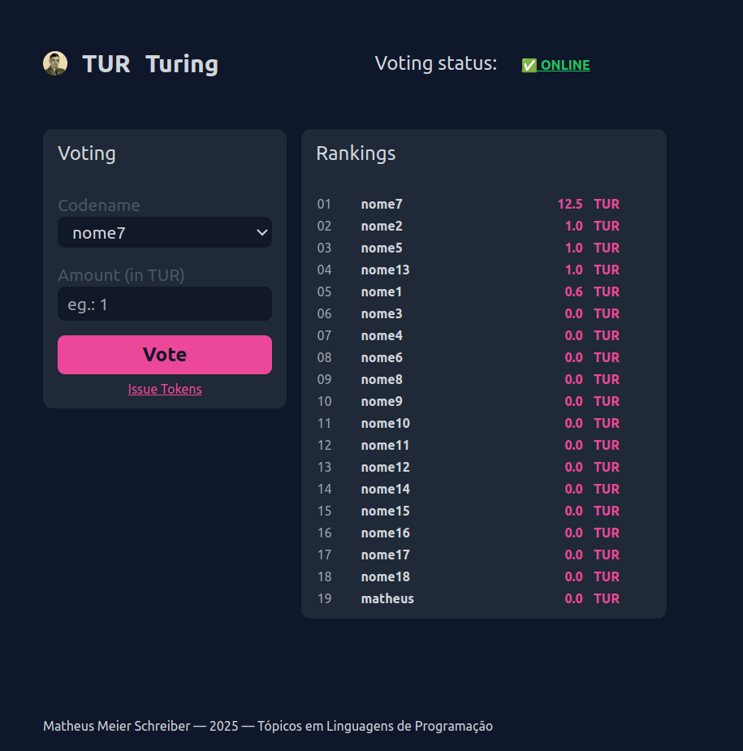

# Decentralized App - Voting system

This project is a decentralized application (DApp) for a voting system built on the Ethereum blockchain. It allows users to vote on proposals in a transparent and secure manner using a smart contract.

## Getting Started

To run this project, follow these steps:

1. **Install dependencies**:
    ```shell
    npm install
    ```

2. **Compile the contract**:
    ```shell
    npx hardhat compile
    ```

3. **Start the local blockchain node**:
    ```shell
    npx hardhat node
    ```

4. **Deploy the contract**:
    ```shell
    npx hardhat run --network localhost scripts/deploy.js
    ```

5. **Start the React application**:
    ```shell
    npm start
    ```

This will launch the DApp, allowing you to interact with the voting system through the web interface.

## Views


<p align="center">Main Page</p>

## Info

- [Solidity Docs](https://www.dappuniversity.com/articles/solidity-tutorial)

- [Hardhat Docs](https://hardhat.org/docs)

- [Helper Project](https://github.com/quiknode-labs/moddApptut)
